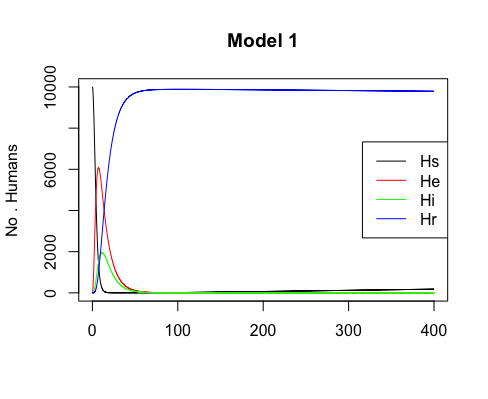
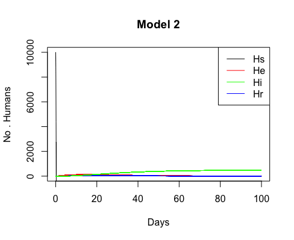

---
authors:
- Kevyn Raynal
- Clément Violet
documentclass: article
classoption: oneside
dates: Semestre 9 --- Master MODE
langue: true
lang: fr-fr
geometry:
  - left = 2cm
  - right = 2cm
  - top = 2cm
  - bottom = 2cm
mainfont: Lato
fontsize: 12pt
toc: false
linestretch: false
---

# Objectif du modèle

L’objectif de ce modèle est d’observer la dynamique de la transmission de la dengue par le moustique *Aedes albopictus*. Cette maladie infectieuse menace chaque année près de 40% de la population mondiale et infecte chaque année entre 50 et 100 millions de personnes selon l’OMS. L’originalité de ce modèle est qu’il ne s’intéresse pas à la principale espèce de moustique vecteur de la dengue qui est *Aedes aegypti*. Si les auteurs préfères s’intéresser à *Aedes albopictus*, c’est parce que cette espèce a été la cause de plusieurs épidémies de dengue, cette espèce est plus difficile à contrôler, elle a un taux de morsure supérieur et est plus compétitive qu’*A. aegypti*.

Les auteurs ont créé un premier modèle en couplant un modèle classique SEIR pour modéliser la dynamique de l'infection chez l'Homme avec un modèle SEI pour modéliser la dynamique de la maladie chez le vecteur.

Le modèle de dynamique chez l'Homme est le suivant :

$$ \frac{dH_s}{dt} = \lambda H_t - H_s \left(\frac{cV_i}{H_t} + \mu_h\right)$$ {#eq:eq1}
$$ \frac{dH_e}{dt} = H_s \frac{cV_i}{H_t} - H_e (\tau_{exh} + \mu_h)$$ {#eq:eq2}
$$ \frac{dH_i}{dt} = H_e\tau_{exh} - H_i\left(\tau_{ih} + \alpha + \mu_h\right)$$ {#eq:eq3}
$$ \frac{dH_r}{dt} = H_i\left(\tau_{ih}\right) - \mu_h H_r$$ {#eq:eq4}

Avec les équations {@eq:eq1}, {@eq:eq2}, {@eq:eq3}, {@eq:eq4} faisant référence respectivement au nombre de personnes sensibles, exposées, infectées, immunisées. Le modèle de dynamique épidémiologique pour le moustique est celui-ci :

$$ \frac{dV_s}{dt} = \mu_aV_t - V_s \left(\frac{cH_i}{H_t} + mu_a\right)$$ {#eq:eq5}
$$ \frac{dV_e}{dt} = V_s \frac{cH_i}{H_t} - V_e \left(\tau_{ex\nu} + \mu_a\right)$$ {#eq:eq6}
$$ \frac{dV_i}{dt} = V_e\tau_{ex\nu} - \mu_aV_i $$ {#eq:eq7}

Les équations {@eq:eq5}, {@eq:eq6}, {@eq:eq7} font quant à elle référence respectivement aux moustiques sensibles, exposés et infectés.

Les paramètres de ce modèle sont présentés dans le tableau {@tbl:1} adapté de @Erickson_2010.

|                             Nom de la variable                | Variable        | Valeur                 |
| :------------------------------------------------------------ | :-------------: | :--------------------: |
| Taux de croissance de la population humaine                   |  $\lambda$      |  $5,8\times 10^{-5}$   |
| Taux de mortalité humaine                                     |  $\mu_h$        |  $1/28000$ jours       |
| Pourcentage journalier de vecteur nécessitant un second repas |  $s_f$          |  $0.03$                |
| Probabilité de mordre un humain                               |  $b_h$          |  $0,3$                 |
| Probabilité de transmettre la dengue                          |  $t_p$          |  $0,4$                 |
| Probabilité de contact                                        |  $c$            |  $b_h \times t_p$      |
| Inverse du temps d'exposition de l'hôte                       |  $\tau_{exh}$   |  $1/10$ jours          |
| Taux de mortalité des hôtes de la dengue                      |  $\alpha$       |  $0,003$               |
| Inverse du temps d'infection de l'hôte                        |  $\tau_{ih}$    |  $1/4$ jours           |
| Oeufs par ponte                                               |  $e_p$          |  $30$                  |
| Inverse du temps de développement des oeufs                   |  $\tau_e$       |  $0,361$               |
| Taux de mortalité des oeufs                                   |  $\mu_e$        |  $0,05$                |
| Terme de capacité de charge                                   |  $K$            |  $10^{-3}$             |
| Inverse du temps de développement des larves                  |  $\tau_l$       |  $0,134$               |
| Taux de mortalité des larves                                  |  $\mu_l$        |  $0.025$               |
| Inverse du temps de développement des nymphes                 |  $\tau_p$       |  $0,342$               |
| Taux de mortalité des nymphes                                 |  $\mu_p$        |  $0,0025$              |
| Inverse du temps de développement des adultes immaturees      |  $\tau_i$       |  $1$                   |
| Inverse du temps de développement des adultes immaturees      |  $\tau_i$       |  $1$                   |
| Taux de mortalité des adultes                                 |  $\mu_a$        |  $0,0501$              |
| Inverse du temps d'exposition du vecteur                      |  $\tau_{ex\nu}$ |  $1/9$ jours           |
| Temps de nourissage ou de gestation                           |  $\tau_g$       |  $0.401$               |
| Inverse du temps de reproduction                              |  $\tau_r$       |  $1$                   | 

Table: Paramètres utilisés pour construire le modèle 1.
 {#tbl:1}

Ce premier modèle relativement simple a été ensuite largement modifié par les auteurs. Ces derniers ont créé un second modèle en divisant le cycle de vie du moustique *A. aegypti* en six stades de vie distincts : 

1. Oeufs ;
2. Larves ;
3. Nymphes ;
4. Adultes immatures ;
5. Adultes en gestation ;
6. Adultes capable de se reproduire.

Seuls les deux derniers stades de ce cycle de vie peuvent donner lieu à l'infection d'un être humain sensible. En effet, les femelles ayant atteint ces stades de vies doivent consommer du sang pour pouvoir assurer la survie de leurs oeufs. Ce second modèle a été évalué par les auteurs à une température constante de 25°C.

Dans un troisième temps, les auteurs de cet article ont modifié ce troisième modèle pour influencer certaines variables contrôlant le modèle 2. Les variables influencées par la température sont :

- Le temps de développement des oeufs ;
- Le temps de développement des larves ;
- Le temps de gestation des oeufs ;
- Le taux de mortalité des adultes.

Pour réaliser ces trois modèles, auteurs de cet article se basent sur quatre hypothèses :

- La population à une exposition homogène aux moustiques ;
- Il n'y a pas de migration humaine ;
- Il n'y a pas de migration de vecteur ;
- Il existe qu'un seul sérotype de la dengue.

L'hypothèse la plus contraignante pour le modèle est la dernière. Il existe en réalité plusieurs sérotypes pour ce virus. Or, si une personne a déjà été infectée par le passé elle devrait se trouver dans le compartiment immunisé et non pas susceptible. De plus, une personne déjà infectée par un serotype peut être infectée par un autre serotype. Si cette hypothèse était relaxée, elle complexifierait grandement les équations concernant les compartiments susceptibles et  immunisés.

# Reproductibilité de l'article

Pour ce projet, nous avons essayé de reproduire les principaux résultats de cet article à savoir les principaux graphiques de ce modèle. Le premier modèle a été codé en R, puisque le nombre d'équations est relativement restreint.

C'est en essayant de coder par nous-mêmes ce modèle que nous avons rencontré les points négatifs de cet article : la reproductibilité. Bien que les équations soient relativement simples dans le premier modèle, il existe déjà des erreurs de mise en page concernant les équations. Ces erreurs ont été facilement contournées grâce aux autres modèles de l'article qui ne sont qu'une extension du premier. Néanmoins, corriger ces premières erreurs n'a pas été suffisant pour faire fonctionner ce premier modèle : il y avait d'autres erreurs plus insidieuses.

Le tableau décrivant les valeurs des différents paramètres (Tab. {@tbl:tab1}) contient lui aussi des erreurs de mise en page. Le premier modèle ne  contenait qu'une seule erreur dans les paramètres, mais la trouver nous a pris plusieurs heures. La correction quant à elle était  simple à mettre en place. Finalement, nous avons réussi à recréer les résultats pour ce premier modèle (Fig. {@fig:model1}).

{#fig:model1}

Pour le modèle 2, nous n'avons pas réussi à reproduire les résultats des auteurs, car nous avons décelé dans les équations pas moins de 6 fautes différentes. Nous avons essayé de les corriger au mieux, mais nos résultats ne convergent pas vers ceux trouver par les auteurs (Fig. {@fig:model2}).

{#fig:model2}

Il est possible que nos corrections soient également erronées, ou bien alors qu'il y ait d'autres erreurs dans les paramètres du modèle. Certains paramètres sont des fonctions dépendantes de la température. Or l'article ne contient pas ces fonctions mathématiques. L'article contient uniquement leurs images pour une température de 25°C. Nous supposons qu'il y a également des erreurs de typographie pour les images de ces fonctions. Pour les paramètres concernés, nous avons essayé de nombreuses autres valeurs, mais aucune ne convenait. Les auteurs indiquent seulement que nous pouvons trouver ces équations dans le mémoire de master de l'auteur principal. Cependant, aucune version de ce mémoire n'est disponible en ligne.

Pour le dernier modèle, même s'il nous avait été possible de faire fonctionner le deuxième modèle, nous n'aurions pas pu le reproduire. En effet, les auteurs de cet article expliquent avoir fait varier la température grâce à la température de l'air moyenne de la ville de Lubbock au Texas. Bien que ces données soient disponibles sur internet, le fait de ne pas avoir accès aux fonctions mathématiques dont les images servent de paramètres aux modèles 2 et 3 nous empêche de les reproduire.

# Modélisation complémentaire

Pellentesque ac porta purus. Phasellus et pellentesque lacus, pulvinar vulputate dui. Pellentesque posuere pellentesque nisi vel ultricies. Vivamus at neque convallis, dignissim magna eget, aliquet ante. Maecenas venenatis, diam in maximus varius, felis ligula faucibus tellus, at tincidunt ligula ex eu mi. Nunc volutpat leo a nunc laoreet commodo. In hac habitasse platea dictumst. Aenean pellentesque arcu ut lacus pulvinar semper. Etiam convallis, magna maximus congue gravida, urna leo porttitor felis, ut luctus turpis lacus in enim. Vestibulum volutpat nulla libero, id cursus lacus faucibus sed. Quisque finibus metus quis lorem iaculis, a scelerisque diam tincidunt. Nulla placerat blandit quam, eu posuere augue. Cras sem ligula, sodales non sem at, interdum pretium quam. Cras eget justo blandit, lobortis diam sit amet, eleifend lorem.

# Interprétations

Pellentesque bibendum libero metus, sed laoreet nisl ornare eget. Interdum et malesuada fames ac ante ipsum primis in faucibus. Morbi varius mauris eu ipsum pellentesque accumsan a vitae turpis. Sed laoreet finibus purus, venenatis facilisis mi. Curabitur molestie dui nibh, non condimentum metus efficitur nec. Fusce nisl eros, bibendum et fermentum vel, commodo eu est. Sed tristique eleifend felis, sed porttitor tellus luctus non. Mauris eros metus, rhoncus viverra imperdiet eget, tempor in odio. Aliquam dapibus pharetra tortor sit amet fermentum.

# Synthèse

La tentative de reproduire les résultats de cet article scientifique nous a permis de nous confronter à un problème qui fait grand bruit dans la communauté scientifique : la crise de la reproductibilité [@Baker_2016]. Nous avons échoué à pouvoir reproduire l'ensemble des résultats de cet article.

Ce travail nous a permis de nous rendre compte qu'écrire un article n'est pas seulement présenter les résultats de ses travaux. Cela va au delta en permettant à tout chercheur de reproduire les résultats obtenus. Il faut donc prendre  le plus grand soin à vérifier que toutes les données nécessaires sont facilement disponibles : équations, code source, tout devrait être en libre accès. De plus, lors du processus de publication, chaque chercheur devrait relire avec attention les épreuves envoyées par l'éditeur de la revue afin de s'assurer qu'aucune erreur de mise en page n'empêcherait de reproduire les résultats.

# Bibliographie
